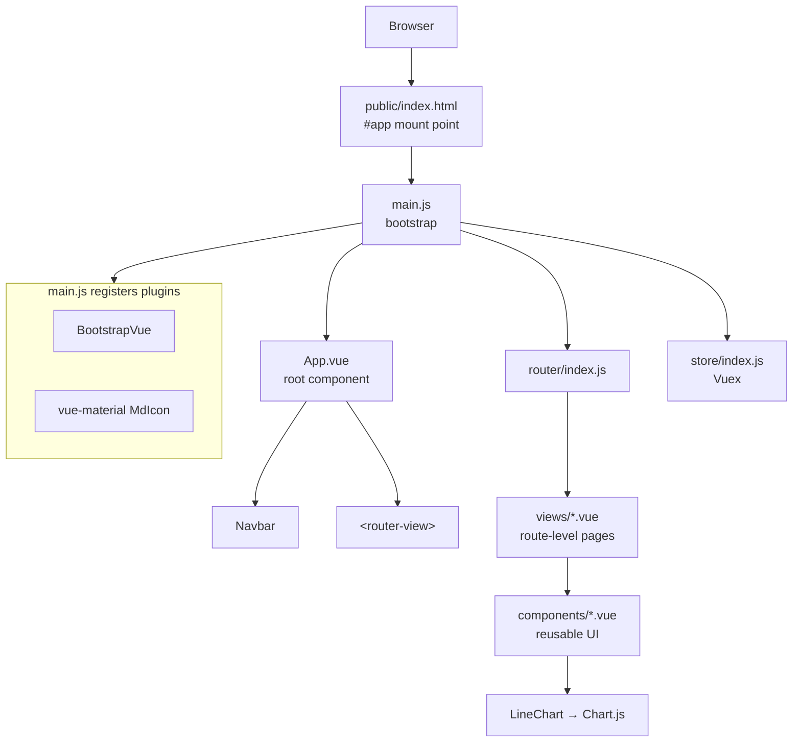
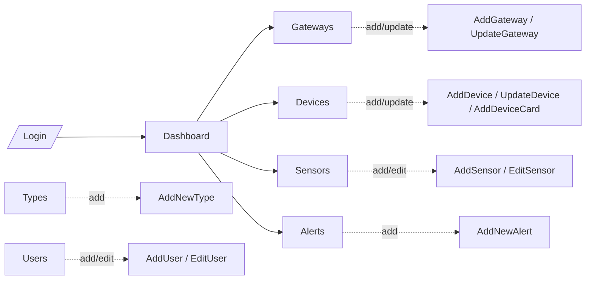
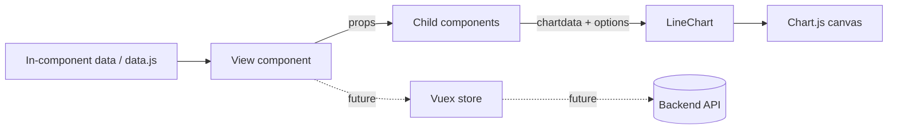
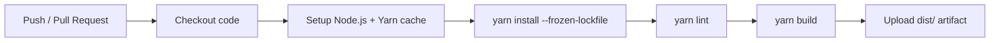

# dataweb

**dataweb** (internal name *Alpha*) is a single-page web dashboard for managing IoT
infrastructure — **gateways, devices, sensors, alerts** and **users**. It provides an admin
interface to register hardware, configure sensors and alert rules, visualize incoming measurements
as charts, and monitor device status at a glance.

> UI reference: [UI Wireframes](https://www.docdroid.net/VwRfAra/ui-wireframes-pdf)

---

## Table of Contents

- [Features](#features)
- [Tech Stack](#tech-stack)
- [Architecture](#architecture)
  - [High-level overview](#high-level-overview)
  - [Application layers](#application-layers)
  - [Routing & navigation](#routing--navigation)
  - [Data flow](#data-flow)
- [Project Structure](#project-structure)
- [Architectural Decisions](#architectural-decisions)
- [Continuous Integration (GitHub Actions)](#continuous-integration-github-actions)
- [Getting Started](#getting-started)
- [Available Scripts](#available-scripts)
- [Configuration](#configuration)

---

## Features

- **Dashboard** — overview of devices with their live alert status in tabular form.
- **Gateways** — register and update IoT gateways.
- **Devices** — register, update and browse connected devices.
- **Sensors** — add and edit sensors and their measurement types.
- **Alerts** — define alert rules (thresholds, ranges) per sensor/device.
- **Types** — manage sensor/measurement type definitions.
- **Users** — user administration (add / edit).
- **Charts** — line-chart visualization of measurement data (Chart.js).
- **Login** — authentication entry point (UI scaffold).

## Tech Stack

| Concern | Choice |
| --- | --- |
| Framework | [Vue 2.6](https://v2.vuejs.org/) (Options API + `@vue/composition-api`) |
| Build tooling | [Vue CLI 4](https://cli.vuejs.org/) (`@vue/cli-service`, Babel, webpack) |
| Routing | [Vue Router 3](https://v3.router.vuejs.org/) |
| State management | [Vuex 3](https://v3.vuex.vuejs.org/) |
| UI components | [BootstrapVue](https://bootstrap-vue.org/) + [Bootstrap 4](https://getbootstrap.com/) |
| Icons / material widgets | [vue-material](https://vuematerial.io/) (`MdIcon`) |
| Charts | [Chart.js 3](https://www.chartjs.org/) via [vue-chartjs](https://vue-chartjs.org/) |
| Linting | ESLint (`plugin:vue/essential`, `eslint:recommended`) + `babel-eslint` |
| Package manager | Yarn (`yarn.lock` committed) |

---

## Architecture

`dataweb` is a **client-side single-page application (SPA)**. There is no backend in this
repository; the app boots into Vue, mounts a router-driven view tree, and (today) renders from
in-component mock data. It is structured around the standard Vue CLI conventions: a single mount
point, a central router, a Vuex store, reusable components, and route-level views.

### High-level overview



### Application layers

| Layer | Location | Responsibility |
| --- | --- | --- |
| **Entry / bootstrap** | `src/main.js` | Creates the Vue instance, registers global plugins (BootstrapVue, vue-material) and CSS, wires in the router and store, mounts to `#app`. |
| **Root shell** | `src/App.vue` | Persistent layout: renders the `Navbar` and the active route via `<router-view>`; holds global styles and CSS variables. |
| **Routing** | `src/router/index.js` | Declares all application routes; route components are lazy-loaded for code-splitting. |
| **State** | `src/store/index.js` | Central Vuex store (currently a scaffold — `state`/`mutations`/`actions`/`modules` are empty and ready to be filled). |
| **Views (pages)** | `src/views/*.vue` | One component per route — list pages (Devices, Sensors, Alerts…) and form pages (AddDevice, EditSensor…). |
| **Components** | `src/components/*.vue` | Reusable building blocks: `Navbar`, `ContentSidebar`, `Modal`, `LineChart`, plus sample chart data. |
| **Static assets** | `public/`, `src/assets/` | `index.html`, favicon, images. |

### Routing & navigation

Routes are registered centrally in `src/router/index.js`. All routes except the default `/` (Login)
are **lazy-loaded** via dynamic `import()`, so each page ships as its own webpack chunk. The `Navbar`
component drives primary navigation (Dashboard, Gateway, Device, Sensor, Alert) and highlights the
active route via `$route.name`.

The main sections map roughly to CRUD flows over the domain entities:



### Data flow

The app follows Vue's standard reactive, prop-driven flow. Today the domain data (devices, alerts,
chart series) is defined **inline within components** (e.g. `Dashboard.vue`'s `data()`, and
`components/data.js` for sample chart data) rather than fetched from an API. The Vuex store exists as
a scaffold and is the intended home for shared state once a backend is integrated.



> **Current limitation:** there is no HTTP/service layer or authentication logic wired in yet — the
> Login screen routes straight to the dashboard, and lists render mock data. Introducing an API
> client and moving shared state into Vuex are the natural next steps (see
> [Architectural Decisions](#architectural-decisions)).

---

## Project Structure

```
dataweb/
├── public/
│   ├── index.html            # SPA host page (#app mount point)
│   └── favicon.ico
├── src/
│   ├── main.js               # App bootstrap: plugins, router, store, mount
│   ├── App.vue               # Root component (Navbar + <router-view>)
│   ├── assets/
│   │   └── logo.png
│   ├── router/
│   │   └── index.js          # Route table (lazy-loaded views)
│   ├── store/
│   │   └── index.js          # Vuex store (scaffold)
│   ├── components/            # Reusable UI building blocks
│   │   ├── Navbar.vue
│   │   ├── ContentSidebar.vue
│   │   ├── Modal.vue
│   │   ├── LineChart.vue      # vue-chartjs Line wrapper
│   │   └── data.js            # Sample chart dataset
│   └── views/                 # Route-level pages
│       ├── Login.vue
│       ├── Dashboard.vue
│       ├── Gateways.vue  AddGateway.vue  UpdateGateway.vue
│       ├── Devices.vue   AddDevice.vue   UpdateDevice.vue  AddDeviceCard.vue
│       ├── Sensors.vue   AddSensor.vue   EditSensor.vue
│       ├── Alerts.vue    AddAlert.vue    AddNewAlert.vue
│       ├── Types.vue     AddType.vue     AddNewType.vue
│       ├── Users.vue     AddUser.vue     EditUser.vue
│       └── Sidebar.vue
├── .eslintrc.js              # ESLint config
├── .browserslistrc           # Target browsers
├── babel.config.js           # Babel preset (@vue/cli-plugin-babel)
├── package.json
└── yarn.lock
```

---

## Architectural Decisions

The following decisions describe how the project is built today and the rationale behind them.

| # | Decision | Rationale |
| --- | --- | --- |
| 1 | **Client-side SPA with Vue CLI** | Fast to scaffold, batteries-included tooling (webpack, Babel, ESLint, dev server with HMR) with zero manual build config. |
| 2 | **Vue 2 + `@vue/composition-api`** | Built on the stable Vue 2 ecosystem while allowing incremental adoption of the Composition API (and an easier future path toward Vue 3 patterns). |
| 3 | **Centralized routing with lazy-loaded views** | Every page is a dynamic `import()`, so the initial bundle stays small and each route is code-split into its own chunk. |
| 4 | **Vuex for state (scaffolded)** | A single source of truth is reserved up front; shared/server state can move here without restructuring once an API is added. |
| 5 | **BootstrapVue + Bootstrap 4 for UI** | A comprehensive, responsive component library (grid, forms, tables, pagination, navbar) that keeps custom CSS minimal. |
| 6 | **vue-material `MdIcon` for iconography** | Material icons integrate cleanly alongside Bootstrap components for a consistent visual language. |
| 7 | **Chart.js via vue-chartjs (`LineChart`)** | Charting is isolated behind a thin, reusable wrapper component that takes `chartdata` + `options` as props. |
| 8 | **Reusable layout primitives** (`ContentSidebar`, `Navbar`, `Modal`) | Shared chrome is factored into components so views focus on their own content via slots and props. |
| 9 | **Views vs. components separation** | `views/` holds route-bound pages; `components/` holds presentation-only, reusable pieces — a clear, conventional boundary. |
| 10 | **ESLint (vue/essential + recommended)** | Enforces baseline code quality and Vue best practices; `no-console`/`no-debugger` warn only in production builds. |
| 11 | **Yarn with a committed lockfile** | Reproducible dependency installs across environments. |

### Suggested next steps

- Extract mock data from components into a dedicated **API/service layer** and populate the **Vuex
  store**.
- Add real **authentication** and route guards (the Login flow is currently a UI scaffold).
- Add **automated CI** (see below) and a unit/component test setup (e.g. Vitest/Jest + Vue Test
  Utils).

---

## Continuous Integration (GitHub Actions)

Continuous integration is defined in [`.github/workflows/ci.yml`](.github/workflows/ci.yml). It runs
on every push and pull request against `master`, installing dependencies, linting, building the
production bundle, and uploading the result as an artifact.



The workflow:

```yaml
name: CI

on:
  push:
    branches: [ master ]
  pull_request:
    branches: [ master ]

jobs:
  build:
    runs-on: ubuntu-latest
    steps:
      - name: Checkout code
        uses: actions/checkout@v4

      - name: Set up Node.js
        uses: actions/setup-node@v4
        with:
          node-version: '16'
          cache: 'yarn'

      - name: Install dependencies
        run: yarn install --frozen-lockfile

      - name: Lint
        run: yarn lint

      - name: Build
        run: yarn build

      - name: Upload build artifact
        uses: actions/upload-artifact@v4
        with:
          name: dist
          path: dist/
```

> Adjust the Node.js version to match your target runtime. The build output (`dist/`) is a static
> bundle that can be deployed to any static host (GitHub Pages, Netlify, S3/CloudFront, nginx, …); a
> deploy job can be appended once a hosting target is chosen.

---

## Getting Started

Prerequisites:

- [Node.js](https://nodejs.org/) (a version compatible with Vue CLI 4 — Node 14/16 recommended)
- [Yarn](https://classic.yarnpkg.com/)

Install dependencies:

```bash
yarn install
```

Run the dev server with hot-reload:

```bash
yarn serve
```

Build for production:

```bash
yarn build
```

## Available Scripts

| Script | Command | Description |
| --- | --- | --- |
| Serve | `yarn serve` | Start the dev server with hot-reload. |
| Build | `yarn build` | Compile and minify for production into `dist/`. |
| Lint | `yarn lint` | Lint and auto-fix source files. |

## Configuration

Project configuration lives in:

- `.eslintrc.js` — ESLint rules
- `babel.config.js` — Babel preset
- `.browserslistrc` — target browsers (`> 1%`, `last 2 versions`, `not dead`)

For advanced Vue CLI options, add a `vue.config.js` — see the
[Configuration Reference](https://cli.vuejs.org/config/).
